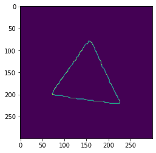
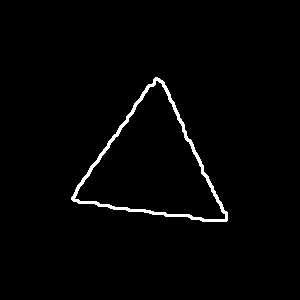
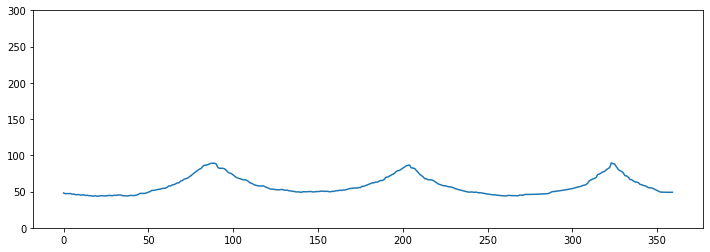

# Fishts

## Abstract

Fishts is a library for transforming images represented in matrix form into a time series-like structure, which can be used by clustering algorithms and other functions. The algorithm allows the customization of parameters such as initial and final angles and the value of each step taken between iterations, which can influence the format of the generated series. The method's output is a numpy array where each position is represented by start + step * i, where start is the starting angle, step is the step used by the method and i is the index of the position of the numpy array.

## Example

<div align='center'>
    <h3>Step 0 - Initial Image</h3>
    
    <br/>
    <br/>
    <h3>Step 1 - Extracting the descriptor</h3>
    <br/>
    
    <br/>
    <br/>
    <h3>Step 2 - Final timeseries-like structure</h3>
    <br/>
    
</div>

## More Examples

Some examples can be find inside the notebooks directory. We prepare examples using 3 datasets, the geometric dataset containing shapes of squares, circles, triangles and stars, this dataset is processed in notebooks 01 and 04.

For the second dataset we use a mpeg subset, containing samples of keys, personal_cars and apples. We work in this dataset in the notebooks marked with 02 and 05.

And for the third one, we use a sample of leaf dataset, containing 10 samples of each leaf species. We process this data in notebooks marked with 03 and 06.

All of the clustering algorithms was applied only considering initial experiments, all of them was applied only for didatic purposes. You can explore all of the clustering algorithms that are in the literature such as DBSCAN, K-Means for clustering and the HDBSCAN that we use. All of the params can also be explored to expand and obtain a better silhouette score.

We can also apply a supervised learning metric, to see the performance of the algorithms grouping the classes correctly in various clusters.

## Use

To use this transformation you need an image in gray scale in a structure similar to a matrix (`np.array`). You can apply all of preprocess in the image before passing them to the algorithm, diferent preprocesses will result in diferent results, maybe better or not depending on the transformations that will apply in the image.

After this we can import and use:
```python
from fishts.descriptors import extract_ts_descriptor

image = ...

# Apply processing here

extract_ts_descriptor(image) # np.array with the distances
```

## Installing

To install this project will only need to execute:
```
pip install git+https://github.com/jose-gilberto/fishts
```
